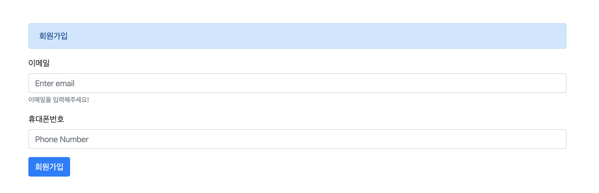
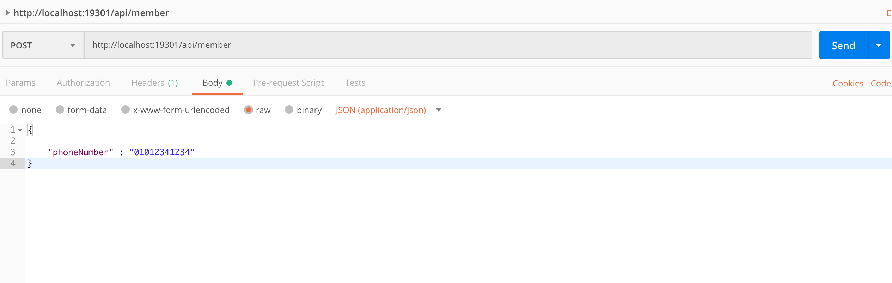
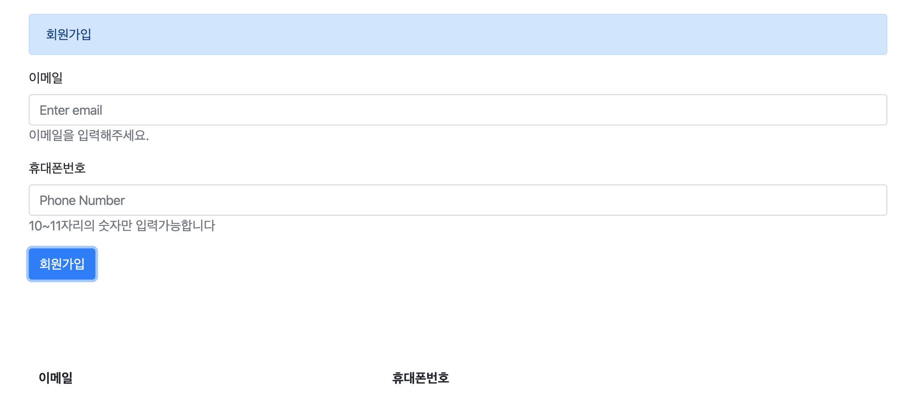
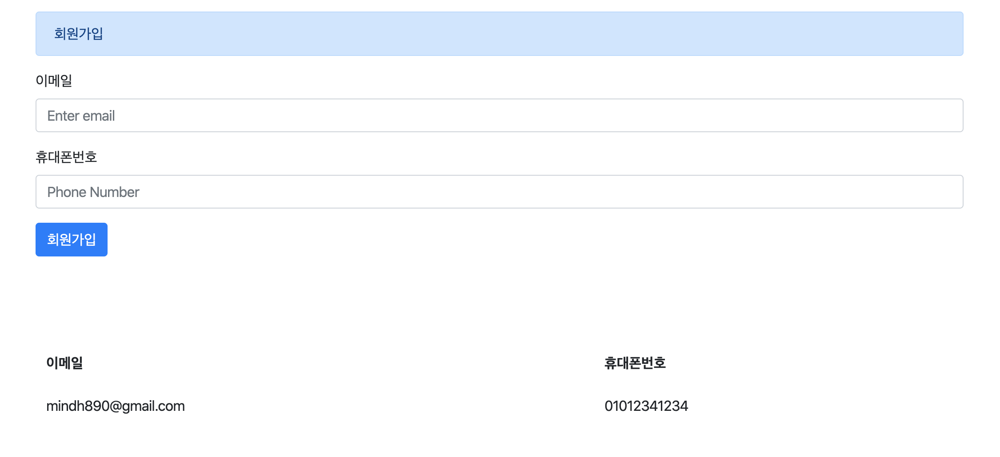

# Validation

이번 시간에는 Spring Validation에 대해 알아보려고 합니다.

클라이언트가 값들을 서버에 보낼 때 클라이언트에서 이 값이 유효한 값인지 한번 검사하고 서버에게 보냅니다.

하지만 클라이언트는 변조의 가능성이 있기 때문에, 서버쪽에서 한번 더 유효성검사를 한 뒤 저장해야합니다.

이런 작업을 Validation(유효성 검사) 라고 합니다. 

Spring에서는 파라미터에 @Valid 어노테이션을 붙여주면 쉽게 유효성 검사를 해줄 수 있습니다.


[git 코드](https://github.com/DaeAkin/spring-validation-example)

## 1. 요구사항

### 1-1. 회원가입 요구사항 

- 휴대폰번호는 10자리이상 11자리 이하여야 한다.
- 이메일은 올바른 형식이어야 한다.

기본으로 Ajax 통신을하여 Restful 방식을 이용하고, view단은 thymeleaf를 사용했습니다.

간단한 디자인은 BootStrap을 이용했습니다.




## 2. Gradle

```groovy
plugins {
	id 'org.springframework.boot' version '2.0.5.RELEASE'
	id 'io.spring.dependency-management' version '1.0.8.RELEASE'
	id 'java'
}

group = 'com.validation'
version = '0.0.1-SNAPSHOT'
sourceCompatibility = '1.8'

configurations {
	developmentOnly
	runtimeClasspath {
		extendsFrom developmentOnly
	}
}

repositories {
	mavenCentral()
}

dependencies {
	implementation 'org.springframework.boot:spring-boot-starter-data-jpa'
	implementation 'org.springframework.boot:spring-boot-starter-web'
	developmentOnly 'org.springframework.boot:spring-boot-devtools'
	runtimeOnly 'com.h2database:h2'
	testImplementation 'org.springframework.boot:spring-boot-starter-test'
	implementation 'org.springframework.boot:spring-boot-starter-thymeleaf'

	compileOnly('org.projectlombok:lombok:1.18.4')
	testCompileOnly('org.projectlombok:lombok:1.18.4')
	annotationProcessor 'org.projectlombok:lombok:1.18.8'

}

```

빠른 예제 셋팅을 위해 인메모리 H2 DB를 사용했습니다.

ORM은 JPA를 이용했습니다.

Getter와 생성자 등 빠르게 만들어 주기 위해 lombok도 사용했습니다.


## 3. Member.class

```java
@Entity
@NoArgsConstructor
@AllArgsConstructor
@Builder
@Getter
public class Member {

    @Id
    @GeneratedValue(strategy = GenerationType.IDENTITY)
    private Long id;

    private String phoneNumber;

    private String email;
}
```

Member 엔티티 클래스를 만들었습니다. 

기본키 생성은 데이터베이스에세 위임했습니다.

## 4. MemberSaveRequest.class

```java
@Data
@Builder
@NoArgsConstructor
@AllArgsConstructor
public class MemberSaveRequest {

    @NotBlank(message = "휴대폰번호를 입력해주세요.")
    @Pattern(regexp = "[0-9]{10,11}", message = "10~11자리의 숫자만 입력가능합니다")
    private String phoneNumber;

    @NotBlank(message = "이메일을 입력해주세요.")
    @Email(message = "이메일을 확인해주세요.")
    private String email;

    public Member toEntity() {
        return Member.builder()
                .phoneNumber(phoneNumber)
                .email(email)
                .build();
    }
}
```

> Member가 저장될 때 사용할 DTO 클래스를 하나 만들었습니다. 
> Member클래스가 있음에도 DTO 클래스를 만든 이유는 SOLID 규칙 중 하나인  `단일 책임 원칙`때문입니다. 
> Member 클래스는 현재 JPA의 Entity의 역할을 하고 있기 때문에, 유효성검사를 해주는 작업까지 해주게되면 
> 책임이 많아지게 됩니다. 

휴대폰번호는 숫자 0~9사이를 받고 10자리 이상 11자리이하입니다. 

이메일은 이메일 형식을 지키도록 했습니다.

## 5. MemberController.class

```java
@Controller
@RequestMapping("/member")
@Slf4j
@AllArgsConstructor
public class MemberController {

    private final MemberRepository memberRepository;

    @GetMapping("/join")
    public String moveToMemberJoinViewPage(Model model) {

        List<Member> memberList = (List<Member>) memberRepository.findAll();
        model.addAttribute("memberList", memberList);

        return "member_join";
    }
}
```

회원가입 페이지로 넘어가게 해주는 Controller 입니다.


## 6. MemberRestController

```java
@RestController
@AllArgsConstructor
@RequestMapping("/api/member")
@Slf4j
public class MemberRestController {

    private MemberRepository memberRepository;

    @PostMapping
    public void insertMember(@Valid @RequestBody MemberSaveRequest memberSaveRequest) {
        log.info("insertMember {} " , memberSaveRequest.toString());
        memberRepository.save(memberSaveRequest.toEntity());
    }

}
```

MemberRepository에 @Autowired 어노테이션이 없는걸 확인하실 수 있습니다.

Lombok의 @AllArgsConstructor 때문인데요,
룸북이 자동적으로 생성자를 만들어 injection을 해주기 때문입니다. 

MemberSaveRequest는 body를 읽어야 하기때문에 @ReqeustBody 어노테이션을 붙여줬고, 유효성 검사를 하기 때문에 @Valid 어노테이션을 붙여줬습니다.

## 7. 단위 테스트
MemberSaveRequest에서 설정한 유효성 검사들이 제대로 이루어지고 있는지 확인하려면 어떻게 해야 할까요?
직접 회원가입 폼을 만들어 회원가입을 해서 로그를 찍어보는 방법이 있습니다.
하지만 그런 방법은 테스트하는 시간이 많이 들어서 효율적이지가 않습니다.

가장 효율적인 방법은 테스트코드를 짜서 실행해보는 것이 가장 효율적입니다.

```java
  @Test
  public void validation_테스트() {
      ValidatorFactory validatorFactory = Validation.buildDefaultValidatorFactory();
      Validator validator = validatorFactory.getValidator();

      MemberSaveRequest memberSaveRequest = new MemberSaveRequest();

      memberSaveRequest.setEmail("mindh890@gmail.com");
      memberSaveRequest.setPhoneNumber("01011114444");
      Set<ConstraintViolation<MemberSaveRequest>> violations = validator.validate(memberSaveRequest);

      System.out.println("violations : " + violations.toString());

      //유효성이 성공적으로 통과됐으면 empty
      //그렇지 않으면 not empty
      assertTrue(violations.isEmpty());

      validatorFactory.close();

  }

```
MemberSaveRequest객체가 유효하지 않다면 violations 변수는 empty가 되지않고 유효성을 통과하지 못한 필드가 안에 남습니다.

패턴이 유효한지 테스트할때 요긴하게 사용됩니다.

## 8. PostMan으로 테스트하기



그렇다면 스프링에서는 유효성 검사에 실패하게되면 어떤 값들을 return 할까요?
PostMan으로 값을 테스트하여 유효성 검사에 실패하도록 만들어보겠습니다.
다음은 email을 빈값으로 두고 서버에 전송하여 리턴받은 값들입니다.

```json
{
    "timestamp": "2019-11-07T04:34:03.517+0000",
    "status": 400,
    "error": "Bad Request",
    "errors": [
        {
            "codes": [
                "NotBlank.memberSaveRequest.email",
                "NotBlank.email",
                "NotBlank.java.lang.String",
                "NotBlank"
            ],
            "arguments": [
                {
                    "codes": [
                        "memberSaveRequest.email",
                        "email"
                    ],
                    "arguments": null,
                    "defaultMessage": "email",
                    "code": "email"
                }
            ],
            "defaultMessage": "이메일을 입력해주세요.",
            "objectName": "memberSaveRequest",
            "field": "email",
            "rejectedValue": null,
            "bindingFailure": false,
            "code": "NotBlank"
        }
    ],
    "message": "Validation failed for object='memberSaveRequest'. Error count: 1",
    "path": "/api/member"
}
```

HttpStatus는 400으로 BAD_REQUEST를 응답받았고,
errors 리스트로 오류내용들이 나옵니다.
그 안에 defaultMessage는 MemberSaveRequest에서 정한 값이 넘어온걸 확인할 수 있고, 어떤 field가 오류인지도 확인할 수 있습니다.

이 값들을 바탕으로 사용자가 확인할 수 있도록 회원가입 폼에 노출시켜주면 됩니다.


## 9. member_join.html

```html
<body id="page-top">
<div id="wrapper">
    <div id="content-wrapper">
        <div class="container-fluid">
            <div class="container p-5">
                <form>
                    <div class="alert alert-primary" role="alert">
                        회원가입
                    </div>
                    <div class="form-group">
                        <label for="email">이메일</label>
                        <input type="email" class="form-control" name="email" id="email" aria-describedby="emailHelp"
                               placeholder="Enter email">

                    </div>
                    <div class="form-group">
                        <label for="phoneNumber">휴대폰번호</label>
                        <input type="text" class="form-control" id="phoneNumber" name="phoneNumber"
                               placeholder="Phone Number">
                    </div>
                    <button type="button" id="saveButton" class="btn btn-primary">회원가입</button>
                </form>
            </div>

        </div>
    </div>
</div>
```

### 9-1. member_join.html 안에있는 자바스크립트 소스
```js
  $('#saveButton').click(function () {
            var data = {
                phoneNumber: $('#phoneNumber').val(),
                email: $('#email').val()
            };
            $.ajax({
                url:'/api/member',
                method: 'POST',
                data: JSON.stringify(data),
                contentType: "application/json; charset=utf-8",
                success: function (response) {
                    alert("회원가입 성공");
                    location.reload();
                },
                error : function(response) {
                    markingErrorField(response);
                }
            });
        });


var markingErrorField = function (response) {
    const errorFields = response.responseJSON.errors;

    if(!errorFields){
        alert(response.response.message);
        return;
    }

    var $field, error;
    for(var i=0, length = errorFields.length; i<length;i++){
        error = errorFields[i];
        $field = $('#'+error['field']);

        if($field && $field.length > 0){
            $field.siblings('.error-message').remove();
            $field.after('<span class="error-message text-muted taxt-small text-danger">'+error.defaultMessage+'</span>');
        }
    }
};
```

Ajax 통신하기 위해서 회원가입 버튼을 누를 경우 /api/member 을 호출하여 데이터를 저장하도록 했습니다.

만약 서버에서 유효성 검사를 하게되면 400 에러를 반환할테니 error 부분에다가 
error 발생시 동작할 코드나 함수를 적어주면 되는데, erros.defaultMessage 를 해당 필드에 노출시키도록 했습니다.


## 10. 유효성 테스트 - 이메일과 비밀번호를 빈칸으로 둘 경우



## 11. 회원가입이 된 경우




이 포스트는 컨트롤러로 들어오는 파라미터의 대한 Validation만 검사해줬습니다. 

그러나 내부로직안에 유효성 검사에 의해 유효성 에러를 낼 수도 있습니다. 예를들어 음식주문과정에서 해당 메뉴가 품절이 되버리면 주문이 되지 않아야합니다. 이런상황에 내는 오류에 대해서는 시간이나면 이 포스팅에 업데이트 하겠습니다.