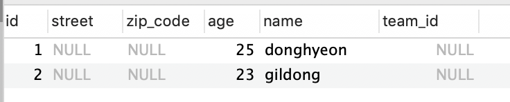
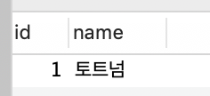
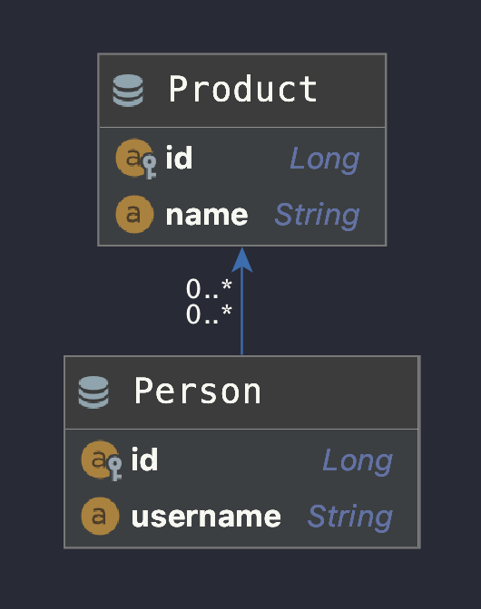
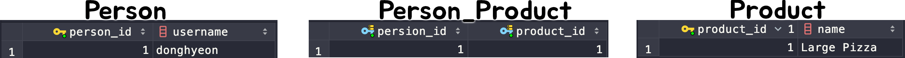

# JPA 연관관계 맵핑

JPA 연관관계 맵핑에서, JPA는 서로다른 테이블을 참조할 때 방향이라는 것이 존재합니다. 

이번에는 JPA 연관관계 맵핑에 대해서 공부해보겠습니다.

## 예제 엔티티

사람인 Human 클래스와 사람이 속할 수 있는 팀인 Team 클래스가 있습니다.

한 팀에는 많은 사람이 속할 수 있습니다. 

**사람**과 **팀**의 관계는 **N : 1** 관계 즉 다대일 관계입니다.(사람 관점에서)

**Human**

```java
@Entity
public class Human {

    @Id
    @GeneratedValue(strategy = GenerationType.IDENTITY)
    private Long id;

    private String name;

    private int age;

    @Embedded
    private Address address;
 }
```

**Team**

```java
@Entity
public class Team {

    @Id
    @GeneratedValue(strategy = GenerationType.IDENTITY)
    private Long id;

    private String name;
}
```


## 단방향

실제 데이터베이스에서는 방향이라는 개념이 존재하지 않습니다. JPA에서만 있는 단어입니다.

Human객체에서 Team을 조회 할수는 있지만, 반대로 Team이 Human을 조회를 하지 못하는 관계를 단방향 관계라고 부릅니다.

```java
@Entity
public class Human {

    @Id
    @GeneratedValue(strategy = GenerationType.IDENTITY)
    private Long id;

    private String name;

    private int age;

    @Embedded
    private Address address;
  
    @ManyToOne
    @JoinColumn(name = "team_id")
    Team team;
 }
```

Human 입장에서는 Human 여러 명이 하나의 Team에 붙게 되므로 Human 입장에서보면 **@ManyToOne**이므로 어노테이션을 붙여주면 됩니다.

@JoinColumn의 역할은 fk로 team의 어떤 필드를 참조할 지 정합니다.  이 값으로 Human과 Team이 조인이 됩니다.

**ERD**


## 양방향

양방향은 단방향과 다르게, Team객체에서도 Human 들을 조회할 수 있습니다.

```java
@Entity
public class Team {

    @Id
    @GeneratedValue(strategy = GenerationType.IDENTITY)
    private Long id;

    private String name;

    @OneToMany(mappedBy = "team")
		List<Human> humans = new ArrayList<>();
}
```

Team 입장에서는 Human과 **1:N** 관계이므로 @OneToMany 어노테이션을 적어주면 됩니다.

### 연관관계의 주인

@OneToMAny는 이해가 한 번에 되지만, **mappedBy속성은** 왜 필요할까요?

실제로는 객체에는 양방향 연관관계라는 것은 없습니다. 서로 다른 단방향 연관관계 2개를 로직으로 잘 묶어서 양방향으로 보이게 할 뿐입니다.

반면에 데이터베이스 테이블은 외래 키 하나로 양쪽이 서로 조인할 수 있습니다.

그럼 왜 mappedBy 속성이 필요할까요?

양방향 연관관계는 단방향 연관관계가 X 2개 있는 것과 동일하기 때문에 이 연관관계 외래키를 관리하는 포인트가 2군데로 늘어 나게 됩니다. 

그래서 한쪽에 두고 사용해야 하기 때문에 **두 연관관계 중 하나를 정해서 테이블의 외래키를 관리**해야 하는데, 이것을 연관관계 주인이라고 합니다.

연관관계 **주인만이 데이터베이스 연관관계와 매핑되고, 외래키를 관리(등록,수정,삭제**)할 수 있습니다. 반면에 주인이 아닌 쪽은 **읽기**만 할 수 있습니다.

- 연관관계 주인은 mappedBy 속성을 사용하지 않는다.
- 주인이 아니면 mappedBy 속성을 사용해서 속성의 값으로 연관관계의 주인을 지정해야한다.

### 연관관계 주인 선택

연관관계의 주인을 정한다는 것은 사실 외래 키 관리자를 선택하는 것입니다.

#### 누가 연관관계 주인이 될래?

지금처럼 휴먼 엔티티에 있는 Human.team을 주인으로  선택하면 자기 테이블에 있는 외래 키를 관리하면 됩니다. 하지만 팀 엔티티에 있는 team.humans를 주인으로 선택하면 물리적으로 전혀 다른 테이블의 외래키를 관리해야 합니다. 왜냐하면 이 경우 Team.humans가 있는 Team 엔티티는 Team 테이블에 매핑되어 있는데, 관리해야 할 외래 키는 Human 테이블에 있기 때문입니다.

지금처럼 **연관관계의 주인은 외래 키가 있는 곳**으로 정합니다. 여기서는 휴먼 테이블이 외래 키를 가지고 있으므로 Human.team이 주인이 됩니다. **주인이 아닌 쪽은 mappedBy 속성으로 사용해서 주인이 아님을 설정**합니다. 

mappedby 속성의 값으로 연관관계의 주인인 team을 주면 됩니다. 이 **team은 Human.team 필드** 입니다.

> 데이터베이스 테이블의 다대일, 일대다 관계에서는 항상 다 쪽이 외래 키를 가지기 때문에 @ManyToOne은 항상 연관관계의 주인이기 떄문에 mappedBy 속성이 없습니다.

### 양방향 연관관계 주의점

양방향 연관관계를 설정하고 데이터를 넣을 때 하는 실수는 연관관계의 주인에는 값을 입력하지 않고, 주인이 아닌 곳에만 값을 입력하는 것 입니다.

**테스트코드**

```java
@Test
public void 저장이안되는_테스트() {

    //사람1
    Human human1 = new Human("donghyeon",25);
    em.persist(human1);
    //사람2
    Human human2 = new Human("gildong",23);
    em.persist(human2);

    Team team1 = new Team("토트넘");
    //주인이 아닌 곳에만 연관관계 설정
    team1.getHumans().add(human1);
    team1.getHumans().add(human2);
    em.persist(team1);
}
```

**데이터베이스 결과**

**human 테이블**



**team 테이블**



human테이블의 team_id 값이 null이 들어가는데, 연관관계의 주인이 아닌 Team.humans에만 값을 저장했기 때문입니다. 연관관계의 주인만이 외래 키의 값을 변경할 수 있습니다.

#### POJO 객체를 고려한 양방향 연관관계

그럼 연관관계의 주인인 **Human** 에만 연관관계를 연결해주고 그 반대인 **Team** 에게만 연결해주지 않아도 될까요? **사실 객체 관점에서 보면 양쪽 방향 모두 값을 입력해주는 것이 가장 안전합니다.** 양쪽 방향 모두 값을 입력하지 않으면 JPA를 사용하지 않는 순수한 객체 상태에서 심각한 문제가 발생할 수 있습니다. 

**순수한객체 테스트**

```java
@Test
public void 순수한객체_양방향_테스트() {
    //팀1
    Team team1 = new Team("토트넘");
    Human human1 = new Human("donghyeon",25);
    Human human2 = new Human("donghyeon",25);

    //연관관계 설정
    human1.setTeam(team1);
    human2.setTeam(team1);

    List<Human> humans = team1.getHumans();

    //테스트가 실패한다
    assertThat(humans.size()).isEqualTo(2);
}
```

**결과**

```java
expected:<[2]> but was:<[0]>
Expected :2
Actual   :0
```


이런 문제를 해결하기 위해서는 양쪽 다 관계를 설정해야 합니다.

 human에게 team을 설정했으면, 그 반대인 team도 human을 설정해줘야 합니다. 

```java
@Test
public void 순수한객체_양방향_테스트() {
    //팀1
    Team team1 = new Team("토트넘");
    Human human1 = new Human("donghyeon",25);
    Human human2 = new Human("donghyeon",25);

    //연관관계 설정
    human1.setTeam(team1);
    team1.getHumans().add(human1);

    human2.setTeam(team1);
    team1.getHumans().add(human2);

    List<Human> humans = team1.getHumans();

    assertThat(humans.size()).isEqualTo(2);
}
```

#### 더 편한 방법은 없을까?

이렇게 양방향 관계를 맺을 때 양쪽 모두 관계를 맺어주는 일은 귀찮고 빼먹을 수도 있으며, 코드량이 늘어나게 됩니다. 이 관계를 맺어주는 메소드를 연관관계의 주인인 Human에서 관리하는 것이 더 좋습니다.

```java
public class Human {
		...
      
    @ManyToOne
    @JoinColumn(name = "team_id")
    Team team;

    public void setTeam(Team team) {
        this.team = team;
        team.getHumans().add(this); //반대편 객체도 이어줘야한다.
    }
}
```

이렇게 코드를 리팩토링하면 됩니다.

## @ManyToOne

ManyToOne은 다대일(N:1) 입니다. 다대일 관계의 반대 방향은 항상 일대다 관계고 일대다 관계의 반대는 항상 다대일 관계입니다. 앞전에 만들었던 엔티티를 보면 Human이(N) 이고 Team(1) 이므로 Human 입장에서는 Team과 다대일 관계 입니다. 

다대일 관계에서는 외래 키는 항상 다쪽에 있으므로, 양방향 관계에서 연관관계의 주인은 항상 다쪽입니다.

밑에 @OnetoMany에서 설명하겠습니다.

## @OneToMany

일대다 관계는 다대일 관계의 반대 방향입니다. 일대다 관계는 엔티티를 하나 이상 참조할 수 있으므로 자바 컬렉션인 Collection,List,Set,Map 중에 하나를 사용해야 합니다. 

Team 입장에서는 Human 엔티티를 여러 개 가지고 있으므로 Team은 Human과 일대다 관계를 맺고 있습니다.

### 일대다 단방향 관계

일대다 단방향 관계의 단점은 매핑한 객체가 관리하는 외래 키가 다른 테이블에 있어서 INSERT SQL문 한번에 끝낼 일을 UPDATE SQL문을 추가로 실행해야 한다는 점 입니다.

**Human**

```java
public class Human {

    @Id
    @GeneratedValue(strategy = GenerationType.IDENTITY)
    private Long id;

    private String name;

    private int age;

    @Embedded
    private Address address;
  
//		단방향 테스트를 위해 주석처리
//    @ManyToOne
//    @JoinColumn(name = "team_id")
//    Team team;
//
//    public void setTeam(Team team) {
//        this.team = team;
//        team.getHumans().add(this);
//    }

}
```

**Team**

```java 
public class Team {

    @Id
    @GeneratedValue(strategy = GenerationType.IDENTITY)
    private Long id;

    private String name;

    @OneToMany
    @JoinColumn(name = "TEAM_ID") //HUMAN의 TEAM_ID
    List<Human> humans = new ArrayList<>();

    public Team(String name) {
        this.name = name;
    }
}
```

**테스트**

```java
@Test
public void 테스트() {

    //사람1
    Human human1 = new Human("donghyeon",25);
    em.persist(human1); //INSERT human1
    //사람2
    Human human2 = new Human("gildong",23);
    em.persist(human2); //INSERT human2

    Team team1 = new Team("토트넘");
    //주인이 아닌 곳에만 연관관계 설정
    team1.getHumans().add(human1);
    team1.getHumans().add(human2);
    em.persist(team1); //INSERT team , UPDATE-HUMAN1.fk, UPDATE-HUMAN2.fk

}
```

**sql**

```
Hibernate: insert into human (street, zip_code, age, name) values (?, ?, ?, ?)
Hibernate: insert into human (street, zip_code, age, name) values (?, ?, ?, ?)
Hibernate: insert into team (name) values (?)
Hibernate: update human set team_id=? where id=?
Hibernate: update human set team_id=? where id=?
```

이런 단점은 성능 문제도 있지만 관리도 부담스럽습니다. 이 문제를 해결하기 위해 좋은 방법은 일대다 단방향 매핑 대신에 **다대일 양방향 매핑을 사용하는 것입니다.**

> 다대일 양방향 매핑 vs 일대다 양방향 매핑
>
> 둘다 똑같은 말이지만 연관관계의 주인이 어디있는지 구분하기 위해 사용합니다. 다(N) 쪽이 연관관계 주인이면 다대일 입니다.

## @OnetoOne

일대일 관계는 양쪽이 서로 하나의 관계만 가집니다. 예를 들어 회원은 하나의 사물함만 사용하고 사물함도 하나의 회원에 의해서만 사용됩니다. 

- 일대일 관계는 그 반대도 일대일 관계다.
- 두개의 테이블 중 외래 키는 아무나 가질 수 있다.

### 주테이블에 외래 키

주 객체가 대상 객체를 참조하는 것처럼 주 테이블에 외래 키를 두고 대상 테이블을 참조합니다. 외래 키를 객체 참조와 비슷하게 사용할 수 있어서 객체지향 개발자들이 선호합니다. 이 방법의 장점은 주 테이블이 외래 키를 가지고 있으므로 주 테이블만 확인해도 대상 테이블과 연관관계가 있는지 알 수 있습니다.

### 대상 테이블에 외래 키

전통적인 데이터베이스 개발자들은 보통 대상 테이블에 외래 키를 두는 것을 선호합니다. 이 방법의 장점은 테이블 관계를 일대일에서 일대다로 변경할 때 테이블 구조를 그대로 유지할 수 있습니다.

**Member(주테이블 방법 이용)**

```java
public class Member {

    @Id
    @GeneratedValue(strategy = GenerationType.IDENTITY)
    private Long id;

    private String username;

    @OneToOne
    @JoinColumn(name="locker_id")
    Locker locker;

}
```

**Locker**

```java
public class Locker {

    @Id
    @GeneratedValue(strategy = GenerationType.IDENTITY)
    private Long id;

    private String name;

    @OneToOne(mappedBy = "locker")
    Member member;

}
```


## @ManyToMany

관계형 데이터베이스는 정규화된 테이블 2개로 다대다 관계를 표현할 수 없기 때문에 보통 다대다 관계를 일대다, 다대일 관계로 풀어내는 연결 테이블을 사용합니다. 



Prodcuet와 Person 사이의 **PERSON_PRODUCT** 라는 연결테이블을 하나 만들겠습니다.

**Person**

```java
public class Person {

    @Id @Column(name = "PERSON_ID")
    @GeneratedValue(strategy = GenerationType.IDENTITY)
    private Long id;

    private String username;

    /**
     * @JoinTable.name : 연결 테이블을 지정한다. 여기서는 MEMBER_PRODUCT 테이블을 선택
     * @JoinTable.joinColumns : 현재 방향인 회원과 매핑할 조인 컬럼 정보를 지정한다. MEMBER_ID로 지정.
     * @JoinTable.inverseJoinCloumns : 반대 방향인 상품과 매핑할 조인 컬럼 정보를 지정한다. PRODUCT_ID로 지정
     */
		@ManyToMany
    @JoinTable(name="PERSON_PRODUCT", //연결테이블이름
            joinColumns = @JoinColumn(name="PERSION_ID"), //현재테이블의 어떤 필드와 조인할지
            inverseJoinColumns = @JoinColumn(name = "PRODUCT_ID")) // 상대테이블의 어떤 필드와 조인할지..
		private List<Product> products = new ArrayList<>();

		...
}
```

**Product**

```java
public class Product {

    @Id @Column(name = "PRODUCT_ID")
    @GeneratedValue(strategy = GenerationType.IDENTITY)
    private Long id;

    private String name;

    public Product(String name) {
        this.name = name;
    }
}
```

**Test**

```java
@Test
public void manyToManyTests() {
    Product product = new Product("Large Pizza"); //상품1 저장
    em.persist(product);

    Person person = new Person("donghyeon"); // 사람1 저장
    person.getProducts().add(product); // 사람1 + 상품1 연관맺어주기

    em.persist(person);
}
```




### 양방향 관계 만들어주기

지금까지는 Person만 Product를 조회할 수 있는 단방향 관계였는데, Product도 Person을 조회할 수 있게 양방향 관계로 만들어 보겠습니다.

양방향 관계는 간단합니다. 

**Product**

```java
public class Product {

    @Id @Column(name = "PRODUCT_ID")
    @GeneratedValue(strategy = GenerationType.IDENTITY)
    private Long id;

    private String name;

    public Product(String name) {
        this.name = name;
    }

    //역방향 추가 (양방향)
    @ManyToMany(mappedBy = "products")
		private List<Ordered> orderedList = new ArrayList<>();
}
```

그리고 연관관계를 두 객체 모두 이어줘야 하기 때문에 연관관계 편의 메소드도 작성해주도록 합시다.

**연관관계 주인인 Product에게 작성하겠습니다.**

```java
public void addProduct(Product product) {
    products.add(product);
    product.getPersons().add(this);
}
```

### 음 나는 person_product 테이블에 컬럼을 더 추가하고 싶은데?

지금까지의 방법은 연결 테이블을 자동으로 JPA 처리해주므로 person_product 테이블에 원하는 필드를 더 만들 수 없었습니다. 

여기에 추가로 몇개를 주문 했는지에 관련된 orderAmount를 만들어 보겠습니다.

이를 위해서 **person_product 대신에 ordered 테이블을 새로 만들어보겠습니다.**

**Person**

```java
public class Person {

    @Id @Column(name = "PERSON_ID")
    @GeneratedValue(strategy = GenerationType.IDENTITY)
    private Long id;

    private String username;

    @OneToMany(mappedBy = "person")
    private List<Ordered> orderedList;


    public Person(String username) {
        this.username = username;
    }
}
```

**Product**

```java
public class Product {

    @Id @Column(name = "PRODUCT_ID")
    @GeneratedValue(strategy = GenerationType.IDENTITY)
    private Long id;

    private String name;

    public Product(String name) {
        this.name = name;
    }

    @OneToMany(mappedBy = "product")
    private List<Ordered> orderedList = new ArrayList<>();

}
```

**테스트**

```java
@Test
public void manyToManyTests() {
    Product product = new Product("Large Pizza"); //상품1 저장
    em.persist(product);

    Person person = new Person("donghyeon"); //사람1 저장
    em.persist(person);

    Ordered ordered = new Ordered(); //주문 저장
    ordered.setProduct(product);
    ordered.setPerson(person);
    ordered.setOrderMount(5);
    em.persist(ordered);
}
```

이렇게 다대다 관계를 일대다 다대일 관계로 풀어봤습니다. 